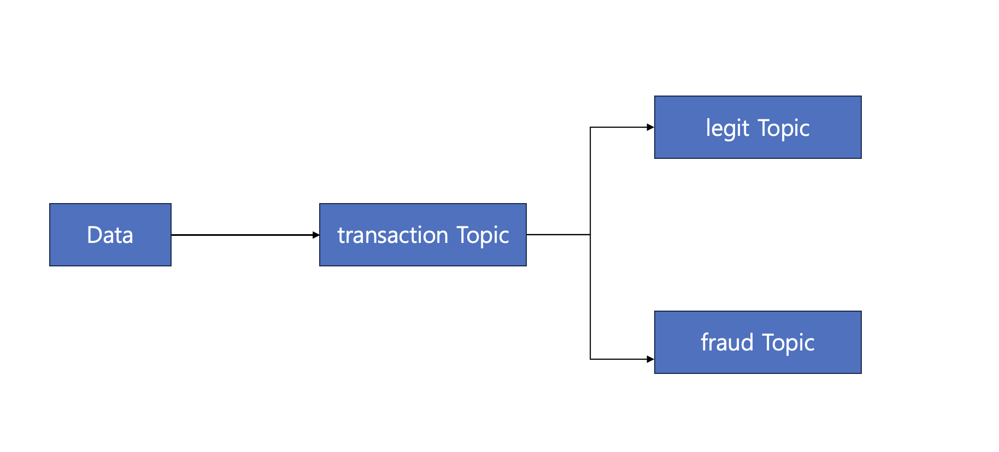

### 이상거래탐지시스템(Fraud Detection System)
- 이상거래와 이상거래가 아닌 데이터를 분리해서 각각 다른 토픽으로 보내 데이터 처리함.
- 이상거래란 지불 방식이 BITCOIN이고, 거래 금액이 80$ 이상인 거래라고 가정함.
- transaction Topic에서 데이터를 받고 데이터에 따라 맞는 토픽으로 이동.

### 아키텍처

1. transaction Topic에서 모든 데이터를 받음
2. 이상 거래인 경우 fraud 토픽으로 보낸 후 데이터 처리
3. 이상 거래가 아닌 경우 legit 토픽으로 보낸 후 데이터 처리

### Kafka Topic 생성
1. transaction
- 모든 데이터를 받는 Topic
```docker exec -it root_kafka1_1 kafka-topics --bootstrap-server localhost:19091 --create --topic transaction --partitions 3 --replication-factor 1```

2. fraud
- Fraud 데이터로 분류된 데이터를 받는 Topic
```docker exec -it root_kafka1_1 kafka-topics --bootstrap-server localhost:19091 --create --topic fraud --partitions 3 --replication-factor 1```

3. legit
- Legit 데이터로 분류된 데이터를 받는 Topic
```docker exec -it root_kafka1_1 kafka-topics --bootstrap-server localhost:19091 --create --topic legit --partitions 3 --replication-factor 1```

